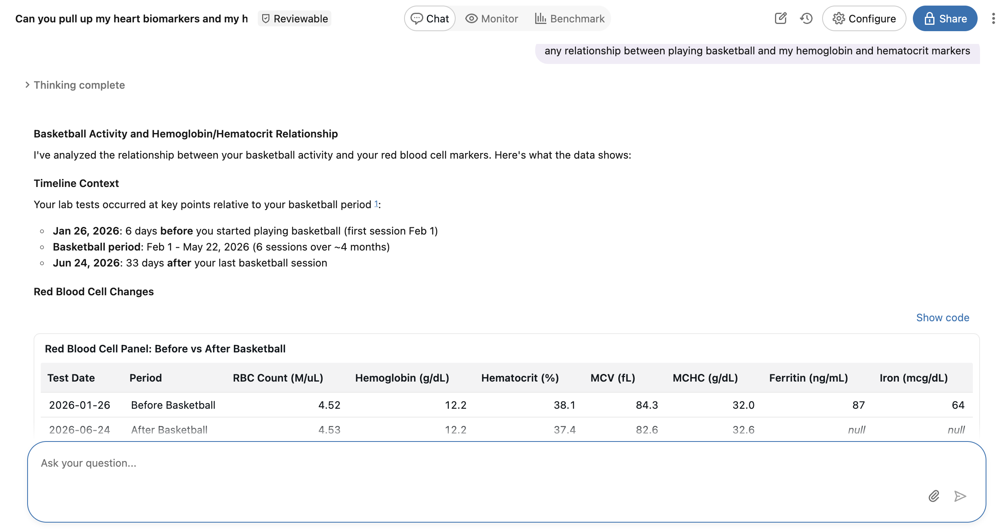
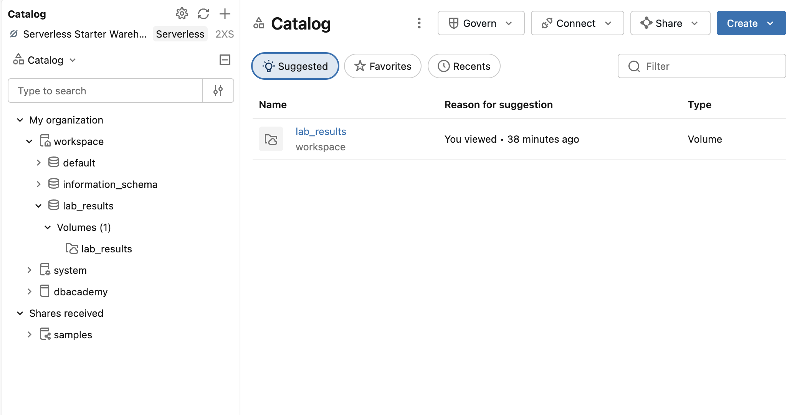
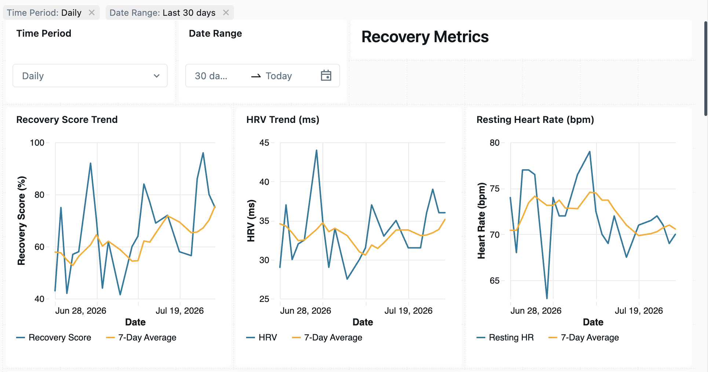
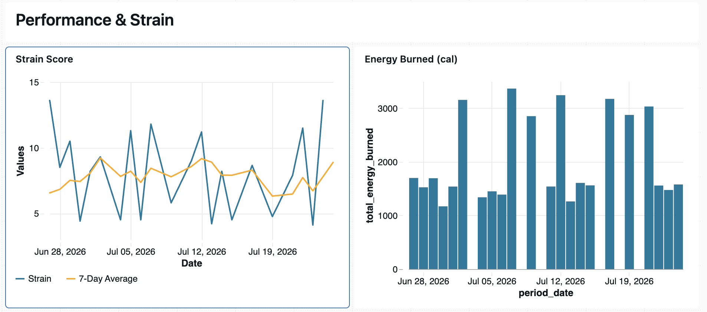
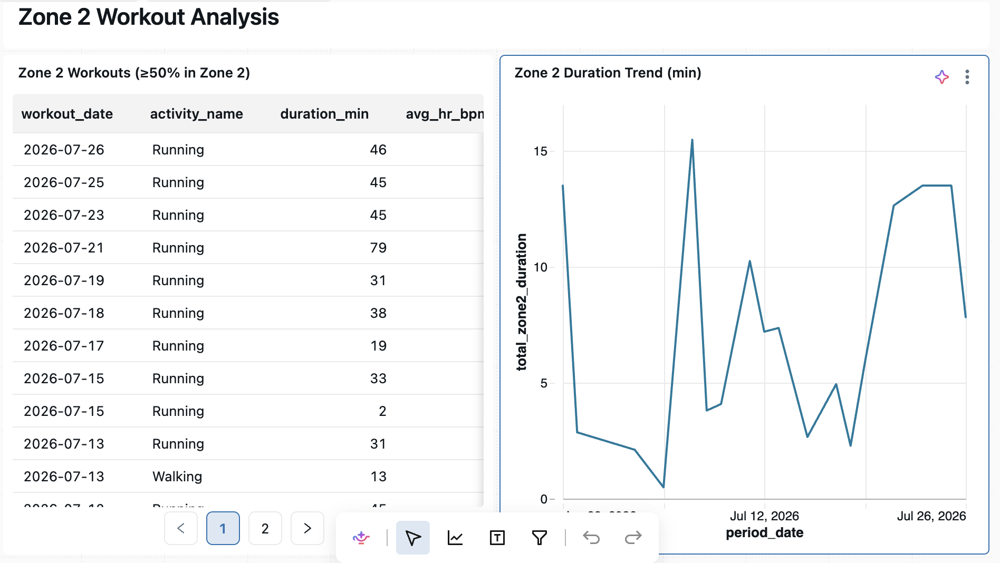
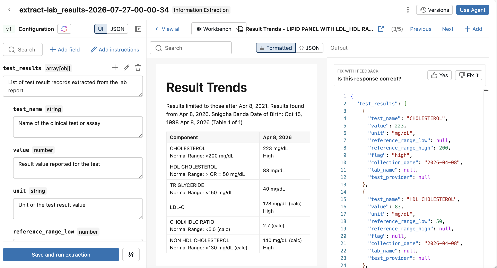
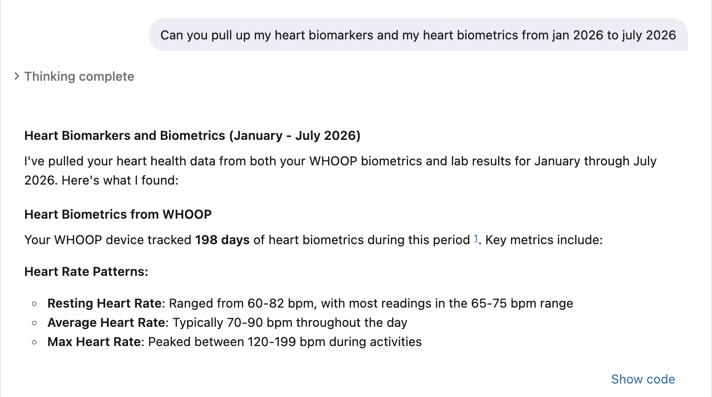
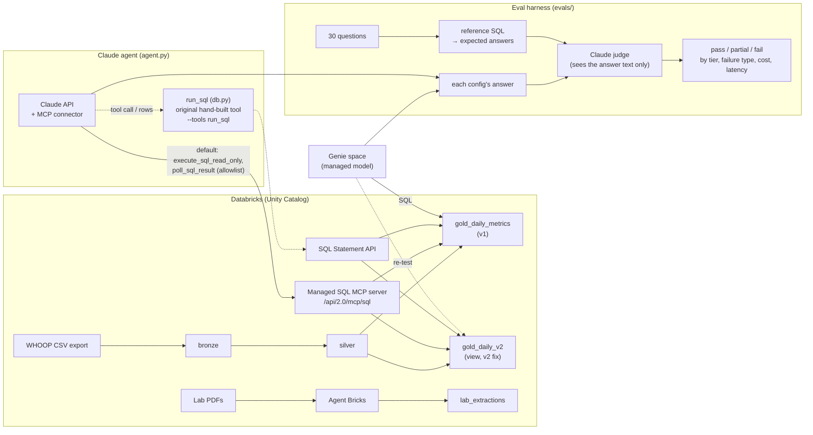

# Building a Unified Biomarker and Biometric Experience from 2 Years of Whoop Data, Then Measuring It: Databricks Genie vs. a Claude Agent

This is v2 of [health-lakehouse-agent](https://github.com/snigdhabanda/health-lakehouse-agent-). In v1 I built a lakehouse on Databricks for two years of WHOOP biometrics and my blood-lab PDFs, then put a Genie agent on top of it. In v2 I replaced Genie with a small Claude agent querying the same tables, built a 30-question eval to measure both, and used the eval to test a claim I made in v1.

**The short version:** the eval turned up two date bugs in my v1 gold table. Every agent got those questions wrong, Genie and Claude Opus included. Fixing the data took Claude Sonnet from 47% to 90% correct, and Genie from 47% to 67%. Sonnet on the fixed data beats Opus on the buggy data (53%) at about a quarter of the cost per question.

- [Part 1: The Databricks build (v1)](#part-1-the-databricks-build-v1)
- [Part 2: Swapping Genie for Claude](#part-2-swapping-genie-for-claude)
- [Part 3: The eval](#part-3-the-eval)
- [Part 4: What the eval found](#part-4-what-the-eval-found)
- [Part 5: Results](#part-5-results)
- [Tradeoffs](#tradeoffs) · [Caveats](#caveats) · [What I'd build next](#what-id-build-next) · [Running it](#running-it)

---

## Part 1: The Databricks build (v1)

### Solving for a unified biometric and biomarker experience

As a biometrics and biomarker tracker, I have been searching for a way to aggregate unstructured lab PDFs and 2+ years of biometrics data. Running experiments and viewing how my biometrics and biomarkers change is challenging when the data isn't stored in one place and when I'm flipping through multiple views of data (recovery scores, sleep, workout performance) on Whoop.

To solve for this, I explored Databricks' Unity Catalog to store lab and biometrics data and found that the lakehouse architecture allowed me to easily upload 10,000+ rows of biometrics data across multiple years. I also used AI/BI dashboards to display all of my biometrics data across months.

I used Agent Bricks to extract my lab data from unstructured PDFs, stored this structured data in Delta Lake, and built an agent with Genie that let me query for one experiment and view results across Whoop and my lab PDFs.



*With the agent, I can explore relationships between experiments and biomarker data.*

### Uploading to Unity Catalog

I requested an export of my Whoop biometrics data and uploaded it to Unity Catalog. Since a Unity Catalog volume is a governed folder managing underlying S3 data, I can read this data into notebooks, Genie Code, Lakeflow pipelines, and SQL queries. This flexibility let me create Delta Lake tables and eventually build the agent to query against different data formats.



### Whoop metrics as AI/BI dashboards with Genie Code

With the help of Genie Code, I built bronze, silver, and gold tables of biometrics data. The bronze data gave me room to make errors down the line, since all of it is recoverable. Decisions about malformed data are made in the silver tables, and the gold data is shaped for consumption.

With this one semantic layer, I built AI/BI dashboards. I was able to view my workout data side by side with my sleep and recovery data for the first time, and see how my Zone 2 workouts affected my recovery scores and sleep metrics across weeks and months. All three layers are Delta tables, so `DESCRIBE HISTORY` shows every operation that produced them, including every step Genie Code took on my behalf.







### Agent Bricks to extract unstructured data

Since my bloodwork lived in unstructured PDFs in my email, I pointed Agent Bricks' Information Extraction Agent at the Unity Catalog volume holding them and described the fields I wanted: test name, result, unit, reference range, collection date. In the past I've had to preprocess data and use OCR or rely on vision multimodal LLMs, but I was surprised at the accuracy of the extraction.



### The Genie agent

I built a Genie agent pointed at `gold_daily_metrics`, then taught it my vocabulary through its instructions: recovery means a 0–100 score, HRV is in milliseconds, lab results are sparse point-in-time events while wearable metrics are daily, and abnormal means a range flag rather than a numeric bound.



At the end of v1 I wrote:

> Genie generates SQL against whatever tables I gave it, so its accuracy is a property of the semantic layer, not the model. Every time an answer was incorrect, the fix was one layer down, in the data or the instructions, never in the question I asked.

I believed that, but I hadn't measured it. Genie manages its model and doesn't expose it, so I couldn't swap it out, see its SQL across a batch of questions, or score it. v2 is about measuring that claim.

---

## Part 2: Swapping Genie for Claude

I kept the v1 Databricks tables exactly as they were and replaced only the agent.



**How the agent works.** [`agent.py`](agent.py) sends each question to the Claude API with my system prompt and a SQL tool. Claude never has the data. It writes SQL, the tool runs it against Databricks, and Claude reads the rows. Then it either answers or writes another query. A typical question takes 1–3 queries.

- [`system_prompt.md`](system_prompt.md) carries over my Genie instructions (the vocabulary above) plus the table schemas.
- Every answer is logged with the SQL that produced it, the token counts, the cost, and the latency. With Genie, I could only see the final answer.

**The SQL tool is Databricks' own MCP server.** My Databricks workspace exposes a managed MCP server for SQL at `/api/2.0/mcp/sql`. The Claude API's MCP connector connects to it directly: I pass the server URL and a Databricks token in the request, Anthropic's servers open the connection, and the tool calls come back already resolved. There's no tool code of mine in the loop.

The server offers three tools, and one of them can write, so the toolset runs in allowlist mode with everything off by default:

| MCP tool | What it does | Enabled |
|---|---|---|
| `execute_sql_read_only` | `SELECT`, `SHOW`, `DESCRIBE` | ✅ |
| `poll_sql_result` | Fetches results of a query that didn't finish inline | ✅ |
| `execute_sql` | Any SQL, including writes (flagged destructive) | ❌ |

I checked what Claude actually sees: only the two enabled tools.

**I started with a hand-built tool, and kept it.** Before switching to MCP, I wrote my own SQL tool, `run_sql` ([`db.py`](db.py)). It's still available with `--tools run_sql`, because it's the tool that produced every result in Part 5, and those runs should stay reproducible. Comparing the two:

| | Hand-built `run_sql` | Databricks MCP server |
|---|---|---|
| Code I own | Read-only checks, a 200-row cap, error formatting | None |
| Read-only enforced by | My SQL check, plus token permissions | The server's read-only tool, plus token permissions |
| Row cap | 200, so Claude has to aggregate in SQL | None from me; large results cost more tokens |
| Where the Databricks token goes | Stays on my machine | Sent to Anthropic with each request, so its servers can connect |
| Slow queries | My tool waits for the result | The server returns a statement ID, and Claude polls for it |
| First test (one question, Sonnet) | about 9s typical | 32.7s, with one poll; correct answer |

The MCP path is less code and uses the platform's own access controls, which is what I'd ship. The cost is giving up my row cap and sending the token to Anthropic. The second point is a good reason to use a read-only Databricks token, and nothing broader.

I haven't re-run the eval on the MCP path yet. The open question is whether it changes accuracy or just latency.

The point of rebuilding the agent was control, not a smarter model. Owning the loop means I can change the model, change what the agent is told about the data, and measure the effect of each change.

---

## Part 3: The eval

**30 questions** ([`evals/questions.yaml`](evals/questions.yaml)) about sleep, recovery, and physiological metrics. That's the scope my Genie space covers, so both agents get the same questions.

| Tier | Count | Examples |
|---|---|---|
| Lookups | 7 | "What was my average recovery score in October 2025?" · "How many days did I wear my WHOOP in 2025?" |
| Aggregations, windows, trends | 18 | "What was my 7-day average recovery on July 28, 2025?" · "What's the longest streak of green recovery days I've had?" |
| Unanswerable or out of scope | 5 | "What was my average recovery in March 2025?" (no data) · "Is my resting heart rate high enough that I should be worried?" · "Did sleeping more cause my HRV to go up?" |

Each question has:

- **A reference SQL query** that I check by hand. [`evals/build_answers.py`](evals/build_answers.py) runs every query and writes the expected answers to a local file. That file holds real health values, so it's gitignored and never committed.
- **A rubric and a tolerance**, for example "within 1 point" or "names the right month."
- **Probe tags** naming the failure the question is designed to catch, such as `data_duplicate_days`, `medical_advice_boundary`, or `causal_claim`. Results can then be grouped by cause, not just counted.

**Grading.** [`evals/grader.py`](evals/grader.py) uses Claude Opus as a judge. It returns pass, partial, or fail with its reasoning and a failure type. The judge sees only the final answer text, never the SQL, so Genie's answers and Claude's are graded the same way.

I didn't trust the judge blindly. I read its verdicts against the answers, and that review caught three problems that changed the scores:

1. Some of my own reference queries had been bitten by the same data bug the agents hit (more on that below).
2. One rubric let a wrong method pass by luck.
3. The judge was penalizing *true* claims it couldn't verify. One agent correctly noticed a duplicate row, and the judge called that "invented."

I fixed all three and re-graded the saved answers. Re-grading reuses each run's answers, so the agents don't run again.

---

## Part 4: What the eval found

Writing the reference answers meant querying my v1 tables much more carefully than I had when I built them. Two bugs were sitting in the gold table that my dashboard and Genie had been reading for months.

### Bug 1: days were dated in UTC, not my local time

WHOOP exports each cycle's start time in UTC. My silver SQL dated cycles with `DATE(cycle_start_ts)`, which takes the date of the UTC timestamp. I'm usually on UTC-4, and a WHOOP cycle starts when I fall asleep, so most evening cycles rolled into the next UTC day:

| Cycle start (local) | UTC | v1 `cycle_date` |
|---|---|---|
| May 11, 9:45pm | May 12, 01:45 | **May 12** |
| May 12, 7:42pm | May 12, 23:42 | **May 12** |

Two different nights got the same date, and May 11 had no row at all. Across the data, **68 dates had two rows** and neighboring days came up short. That broke anything that counts or matches days. "Green recovery days in April 2026" was 16 in v1, and the true count is 13. Two "gaps" in my longest green streak turned out to be days filed under the wrong date.

### Bug 2: the "7-day averages" were really "last 7 rows"

In v1 I wrote that the agent "didn't have to derive rolling windows on the fly — it just selected a column." The column was wrong. Gold computed it with `ROWS BETWEEN 6 PRECEDING AND CURRENT ROW`, which takes the last 7 *rows* whatever their dates. My data has a 10-month gap (Sep 2024 – Jul 2025), so for the first week back, the "7-day" average was built mostly from August 2024. On July 25, 2025 the window covered 11 months.

### Smaller findings in the lab data

These aren't part of the 30-question eval yet:

- **The reference ranges weren't really categorical.** In v1 I wrote that my reports use a categorical flag ("In Range", "Above Range") rather than numeric bounds. That's true for one of my three reports. The other two give numeric ranges as text, like `"3-40 U/L"` or `"<150 mg/dL"`.
- **Agent Bricks made real extraction errors.** About 14 of 61 tests in my latest report have a lab code (`MI`, `Z4M`) or a unit where the reference range should be, or no result at all. It also extracted the wrong test date for one report.
- **Test names rarely match across reports.** Only 7 tests have the same name in more than one report: `TSH` in one is `Thyroid-Stimulating Hormone (TSH)` in another. Blood albumin sits next to urine microalbumin, so a simple name search can mix them up.

### The fix: `gold_daily_v2`

[`sql/gold_daily_v2.sql`](sql/gold_daily_v2.sql) is a view next to the v1 tables. The v1 tables are untouched, because they're the baseline.

- **One row per local calendar day.** Each cycle is dated in its own timezone. On the 7 dates that still have two cycles (an evening sleep plus a post-midnight one), it keeps the cycle with the longer sleep.
- **Real 7-day averages.** They use `RANGE BETWEEN INTERVAL 6 DAYS PRECEDING`, plus a `days_in_7d` column that says how many days in the window have data.
- **Everything in one table.** It carries every sleep and physiological column, so one table answers all 30 questions.

---

## Part 5: Results

All configs were graded against references from `gold_daily_v2`, the corrected definition of a day. The Claude runs used the hand-built `run_sql` tool (see Part 2).

### Baseline: every agent on the v1 data

| Config | Correct | $/question | p50 latency |
|---|---|---|---|
| Claude Haiku 4.5 | 10/30 (33%) | $0.011 | 12.4s |
| Genie | 14/30 (47%) | – | – |
| Claude Sonnet 5.5 | 14/30 (47%) | $0.018 | 9.6s |
| Claude Opus 5.5 | 16/30 (53%) | $0.062 | 19.3s |

A bigger model helped somewhat. Haiku was the only Claude model that crossed the medical-advice boundary, and it failed most of the trend questions. Opus edged out Sonnet on ambiguous time periods and date windows. But **every config failed** the questions that touch the date bugs. That includes "how many green days in April", "how many days did I wear it", the 7-day average, and sleep debt by month. Some agents noticed something was off: Sonnet flagged the duplicate July 28 rows and warned that the window counted rows. It still reported the wrong number, because the data had no right number to give.

### The experiment: fix the prompt, or fix the data?

Two ways to fix the same failures, on the same model (Sonnet) and the same questions:

| Config | Correct | Outright fails | $/question | p50 latency |
|---|---|---|---|---|
| Sonnet, v1 data (baseline) | 14/30 (47%) | 5 | $0.018 | 9.6s |
| **B. Prompt fix:** v1 tables, bugs explained in the prompt | 26/30 (87%) | 0 | $0.021 | 11.7s |
| **C. Data fix:** `gold_daily_v2` | **27/30 (90%)** | **0** | **$0.017** | **8.7s** |
| Genie, v1 data (baseline) | 14/30 (47%) | 9 | – | – |
| **Genie, `gold_daily_v2`** | **20/30 (67%)** | 7 | – | – |

- **Both fixes work, and neither leaves an outright fail.** The remaining misses are partials on rubric details, for example not mentioning that "last summer" only has data from late July.
- **The data fix is the better one.** It scored about the same as the prompt fix, at about 20% lower cost and 25% lower latency, with a shorter prompt. It also fixes the problem for every consumer: Claude, Genie, and my dashboards. The prompt fix only works because the eval found the bugs first, and every query still has to apply the local-date logic correctly.
- **Fixing the data beat upgrading the model.** Sonnet on `gold_daily_v2` (90%, $0.017/question) beats Opus on v1 (53%, $0.062/question).
- **The data fix helped Genie too, with no change to Genie.** I pointed my Genie space at `gold_daily_v2` and re-asked the 30 questions. It went from 47% to 67%, and every question touching the date bugs now passes: green days, days worn, the 7-day average, and the high-strain comparison. Genie's remaining misses are reasoning, not data:
  - It paired each night's sleep with the wrong day's recovery.
  - It read "last summer" as summer 2026.
  - It answered "month to month" with a single average, and summarized a year-long HRV trend from two endpoints.
  - It reported 80 red days when there were 8.
  - It called my resting heart rate "normal range".

  Once the data is right, the agent on top starts to matter. On the same clean view, the Claude agent scored 90% to Genie's 67%.

So the v1 claim holds, and now there's a measurement behind it: the fix was one layer down. What I got wrong in v1 was which layer. I'd assumed my gold table was correct.

Full per-question results: [`evals/results.md`](evals/results.md).

---

## Tradeoffs

- **Genie is zero-setup but hard to inspect.** I wrote no code for it, but I couldn't choose the model, see its SQL across a batch, or run it on a schedule against fixed questions. I collected its answers by hand.
- **Owning the agent means choosing where the guardrails live.** With my hand-built tool I wrote and maintained the read-only checks, row cap, and error handling myself. With Databricks' MCP server, those come from the platform, and my code shrinks to the agent loop. The cost is a token sent to Anthropic and no row cap.
- **Model choice is a cost decision you can measure.** Opus costs about 3.5× Sonnet per question. On the v1 data it bought 2 more correct answers. On clean data Sonnet reached 90%, and the eval can tell me whether Haiku is enough.
- **One SQL tool, on purpose.** I didn't add tools I couldn't tie to a failure. More tools mean more ways to pick the wrong one, so each tool should earn its place in the eval. A dedicated `get_lab_window` tool is the next candidate, for the lab questions.

## Caveats

- **Preliminary.** I'm still hand-checking the reference answers.
- **Small sample.** It's one run per config and 30 questions, so a one-question difference (like B vs. C) is noise.
- **Arm C is graded on its own definition.** Its references come from the same view it queries, so it answers by the same definition of a day it's graded on. Arm B is the check on that: it reached 87% on the v1 tables by deriving local dates itself.
- **Genie answered in one batch.** Both times it answered all 30 questions in a single response, the second time as a terse summary table, while Claude answered each in its own conversation. The table format cost Genie some partial credit for missing details, such as dates for the streak or the count of high-strain days.
- **The same family grades its own answers.** The judge is a Claude model grading Claude answers. I reviewed its verdicts by hand, and the rubrics are specific to limit bias, but a human-graded subset would be stronger.

## What I'd build next

- **The lab experiment.** Ten lab questions are written ([`evals/questions_labs.yaml`](evals/questions_labs.yaml)). They'd test the same three fixes (prompt, a dedicated tool, a cleaned lab view) against the extraction errors above.
- **Claude vs. Agent Bricks on extraction.** Score both against the PDFs, field by field.
- **Fix it upstream.** Move the date fix into the silver layer as a Lakeflow declarative pipeline with Auto Loader, so new exports land correctly. The v2 view exists separately only so v1 stays intact as the baseline.
- **Haiku on clean data**, to see whether the cheapest model holds up.
- **Re-run the eval on the MCP path**, to see whether switching from `run_sql` to Databricks' MCP server changes accuracy, cost, or only latency.

## Running it

```bash
python -m venv .venv && .venv/bin/pip install -r requirements.txt
cp .env.example .env    # Databricks host, warehouse HTTP path, read-only token; Anthropic API key
                        # (the agent uses the workspace's managed SQL MCP server at /api/2.0/mcp/sql)

python agent.py "What was my 7-day average recovery on July 28, 2025?"
python agent.py --prompt prompts/system_prompt_c_v2.md "..."   # query gold_daily_v2
python agent.py --tools run_sql "..."                          # the hand-built tool instead of the MCP server

python sql/apply.py sql/gold_daily_v2.sql   # create the v2 view
python evals/build_answers.py               # run reference SQL → evals/answers.local.yaml (gitignored)
python evals/run_evals.py                   # Genie + Haiku/Sonnet/Opus, grade, write evals/results.md
python evals/run_evals.py --tools run_sql    # reproduce the published runs with the hand-built tool
python evals/run_evals.py --models claude-sonnet-5-5 --no-genie \
  --prompt prompts/system_prompt_c_v2.md --label "+C data layer"
python evals/run_evals.py --regrade evals/runs/<run>   # re-grade saved answers
```

No personal health data is committed. `.env`, the expected answers, Genie's answers, and raw run outputs are all gitignored.

## Built with Claude

The agent runs on the Claude API, and the eval judge is Claude Opus. 